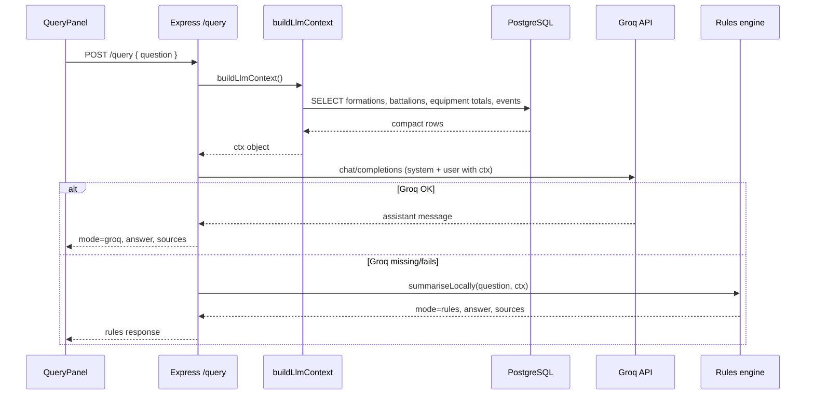

# FieldPulse LLM integration — learning guide

This document explains **exactly how Groq is wired into FieldPulse**, in the order you should learn it if you want to add more models and eventually build multi-LLM workflows (including RAG).

---

## 0. Mental model (read this first)

FieldPulse does **not** “chat with the database.” It does this:

1. User asks a question in the UI  
2. API loads a **compact snapshot** of ORBAT / equipment / events from Postgres  
3. API sends that snapshot + the question to an LLM (Groq first)  
4. LLM answers **only from that snapshot** (system prompt forbids inventing data)  
5. If Groq/OpenAI fail or keys are missing → **rules engine** answers with SQL-derived facts  

That pattern is called **context stuffing** (or “RAG-lite”): retrieve structured data, put it in the prompt, generate an answer.

True **RAG** (embeddings + vector search) is possible later; see section 7.

---

## 1. Files involved (map the code)

| File | Role |
|------|------|
| [`client/src/components/QueryPanel.jsx`](client/src/components/QueryPanel.jsx) | UI: question → `POST /query` → render answer + context cards |
| [`client/src/api.js`](client/src/api.js) | `runQuery(question)` fetch helper |
| [`server/src/routes/query.js`](server/src/routes/query.js) | Express route `POST /query` |
| [`server/src/llm/query.js`](server/src/llm/query.js) | Provider chain: Groq → OpenAI → rules |
| [`server/src/services/orgs.js`](server/src/services/orgs.js) | `buildLlmContext()` — compact DB snapshot |
| [`.env`](.env.example) / deploy env | `GROQ_API_KEY`, `GROQ_MODEL` (server only) |

---

## 2. Sequence of a single query (step by step)



### Step A — UI

`QueryPanel` posts `{ question }` to `/query` and displays:

- Provider pill (`Groq` / `OpenAI` / `Rules engine`)
- Model pill (e.g. `llama-3.1-8b-instant`)
- Answer text
- **Context used** cards (human-readable, not raw JSON counts)

### Step B — Route

[`server/src/routes/query.js`](server/src/routes/query.js) calls `runOperatorQuery(question)` and returns JSON.

### Step C — Context build (critical)

[`buildLlmContext()`](server/src/services/orgs.js) does **not** dump every equipment line. Free Groq tiers often allow only ~6k tokens/minute for small models, so we send:

- Division header  
- Formations (division / brigade / group only)  
- Battalion short list (code, parent, readiness)  
- Equipment **totals by type**  
- Last few events  

This is why an earlier full dump fell back to `rules` with a 413 “request too large” error.

### Step D — Provider chain

In [`server/src/llm/query.js`](server/src/llm/query.js):

```text
try Groq (if GROQ_API_KEY)
  else try OpenAI (if OPENAI_API_KEY)
    else rules engine
```

Both Groq and OpenAI use the **same Chat Completions shape**:

- `POST {baseUrl}/chat/completions`
- Header `Authorization: Bearer <key>`
- Body: `model`, `messages: [{role:'system'}, {role:'user'}]`

Groq’s base URL is OpenAI-compatible:

`https://api.groq.com/openai/v1`

So adding another OpenAI-compatible host (Together, Fireworks, local vLLM, etc.) is mostly: new env vars + one more function like `answerWithGroq`.

### Step E — System vs user prompt

- **System prompt**: role + rules (“answer only from provided data”, stay precise)  
- **User prompt**: question + compact JSON context  

The model never sees your Postgres credentials; it only sees the snapshot you built.

### Step F — Sources for the UI

LLM answers return a `sources` array of `{ label, detail }` cards, e.g. “Formations — 10 division/brigade/group records”. Rules answers can also attach `evidence_rows` for a small supporting table.

---

## 3. Environment configuration (local + live)

| Variable | Meaning |
|----------|---------|
| `GROQ_API_KEY` | Free key from [console.groq.com/keys](https://console.groq.com/keys) |
| `GROQ_MODEL` | Default `llama-3.1-8b-instant` |
| `OPENAI_API_KEY` | Optional paid fallback |
| `OPENAI_MODEL` | Default `gpt-4o-mini` |

**Rules**

- Keys live on the **API** process only (Docker env / host secrets)  
- Never put keys in React or `VITE_*`  
- Never commit `.env`  

Docker Compose interpolates root `.env` into the `api` service. After changing keys:

```bash
docker compose up -d --force-recreate api
```

---

## 4. How to add another LLM provider (recipe)

Goal: e.g. Gemini or a second Groq model as an alternate path.

1. **Get an API key** and note the HTTP API style (OpenAI-compatible vs proprietary).  
2. **Add env vars**: `GEMINI_API_KEY`, `GEMINI_MODEL` (example).  
3. **Write `answerWithX(question, ctx)`** in `server/src/llm/query.js` (or a new `providers/x.js`).  
4. **Insert it in `runOperatorQuery`** in the order you want (e.g. Groq → Gemini → OpenAI → rules).  
5. **Pass `mode` / `provider` / `model` / `sources`** in the return shape the UI already understands.  
6. **Keep `buildLlmContext` shared** so every provider sees the same facts.  
7. **Test failure paths**: wrong key, 429 rate limit, oversized prompt → must fall through cleanly.

### OpenAI-compatible providers (easiest)

If the provider speaks Chat Completions, reuse `chatCompletions({ baseUrl, apiKey, model, ... })` and only change `baseUrl` + env.

### Proprietary APIs (e.g. some Gemini SDKs)

Wrap their SDK, but still:

- same `ctx` from `buildLlmContext`  
- same system instructions  
- same return shape `{ mode, provider, model, answer, sources }`  

---

## 5. From one LLM to a workflow (multi-step)

A **workflow** means more than one model call with a clear handoff. Example FieldPulse workflow:

```text
1) Router LLM (small/fast)
   → classify intent: readiness | equipment | wartime | general

2) Retriever (code, not LLM)
   → SQL filtered by intent (e.g. only MBT/APC rows)

3) Answerer LLM (stronger model)
   → write the final brief from the filtered context

4) Optional Critic LLM
   → check numbers against the JSON; rewrite if hallucinated
```

### Why this matters

- **Cheaper / safer**: small context per step, fewer hallucinations  
- **Composable**: swap Groq for step 1, OpenAI for step 3  
- **Testable**: each step has a typed input/output  

### Minimal implementation sketch

```js
const intent = await classifyIntent(question);          // LLM #1 or rules
const slice = await fetchContextForIntent(intent);      // SQL
const draft = await answerWithGroq(question, slice);    // LLM #2
const checked = await verifyNumbers(draft, slice);      // LLM #3 or code
return checked;
```

Orchestrators you can grow into later: plain functions (start here), Temporal, Inngest, LangGraph, or custom queues.

---

## 6. What FieldPulse does *not* do yet (honest gaps)

- No streaming tokens to the UI  
- No tool calling (model cannot “call” SQL itself)  
- No per-user auth / audit log of questions  
- No conversation memory across questions  
- No embeddings / vector store (see RAG below)  
- Context is **global division snapshot**, not scoped to the brigade page you are viewing  

These are natural next learning projects.

---

## 7. Can we implement RAG here?

**Yes.** FieldPulse is a good RAG candidate because the “documents” are structured military ORBAT + equipment rows + events.

### What RAG means here

**RAG = Retrieval-Augmented Generation**

1. **Index** knowledge offline (or on seed): chunk text + embeddings into a vector store  
2. **Retrieve** top-k chunks relevant to the question  
3. **Generate** an answer with only those chunks in the prompt  

Today we retrieve with **SQL + fixed compact snapshot**. RAG upgrades retrieval to **semantic similarity**.

### Suggested FieldPulse RAG design

| Piece | Choice |
|-------|--------|
| Documents | One chunk per org (“7 Armd Bde readiness 84%…”), one per equipment type, one per event |
| Embeddings | Free/cheap: `nomic-embed` via Ollama, or a cloud embedding API |
| Vector store | `pgvector` in the same Postgres (fits this stack), or Qdrant/Chroma |
| Retriever | Embed question → cosine top-k → attach chunks to prompt |
| Generator | Existing Groq chat call |

### When RAG helps vs when SQL is enough

| Prefer SQL / current approach | Prefer RAG |
|-------------------------------|------------|
| Exact counts, readiness %, ORBAT tree | Doctrine PDFs, SOPs, free-text reports |
| Structured filters (“all MBTs”) | Fuzzy questions (“what limits wet-gap crossing?”) |
| Free-tier tiny context windows | Large document corpora |

**Best hybrid for this app:** SQL for numbers + optional RAG over notes/SOPs/event narratives.

### Example hybrid pipeline

```text
question
  → classify: needs_numbers? needs_docs?
  → if numbers: SQL aggregates (current buildLlmContext / filtered)
  → if docs: vector search over event text + future SOP docs
  → merge into prompt
  → Groq generates answer
  → return answer + source citations (org codes / event ids)
```

### Is RAG required for NestAI interview storytelling?

No. Explaining **context stuffing + provider fallback + token limits** already shows production judgment. Mention RAG as the next evolution: “I’d add pgvector over unit notes and keep SQL for authoritative counts.”

---

## 8. Practice exercises (learn by changing the code)

1. **Change model** to another Groq id and confirm the UI pill updates.  
2. **Add a third provider** with the `chatCompletions` helper.  
3. **Scope context** to the current org id when querying from a brigade page.  
4. **Intent router**: if question contains “bridge”, only send engineer equipment to the LLM.  
5. **Add pgvector**: embed `operational_events.detail` and retrieve top 3 for the prompt.  
6. **Streaming**: use provider streaming APIs and pipe tokens to the client.

---

## 9. Quick reference — failure modes you already hit

| Symptom | Cause | Fix |
|---------|--------|-----|
| `mode: rules` with key set | Groq 413 / TPM — prompt too large | Compact context (already done) |
| `mode: rules`, key empty in container | `.env` not passed / API not recreated | Root `.env` + `docker compose up -d --force-recreate api` |
| 429 rate limit | Free-tier RPM/TPM | Wait, smaller prompt, or upgrade tier |
| Key in git | Accidental commit | Revoke key, rotate, rely on `.gitignore` |

---

## 10. One-paragraph summary

FieldPulse implements LLMs as a **server-side provider chain** over a **compact SQL-built context**. Groq is preferred because it is free and OpenAI-compatible; the UI never sees the API key. Extending to more models means adding providers to the same chain; extending to workflows means splitting classify → retrieve → answer → verify; extending to RAG means replacing or augmenting fixed SQL retrieval with embeddings + vector search while keeping SQL as the source of truth for counts.
