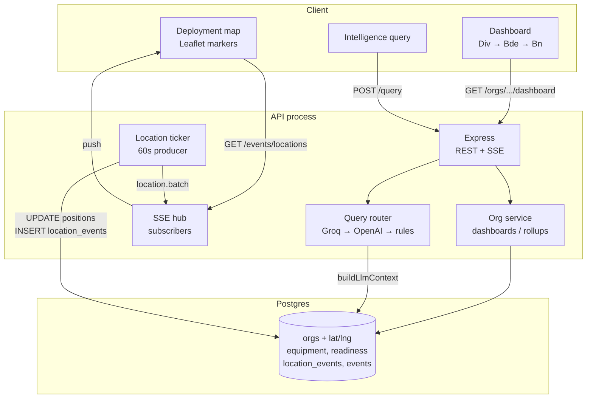

# FieldPulse

Division-level operational picture for **HQ 6 Armoured Division** (Gujranwala): ORBAT drill-down, equipment/readiness, deployment map with live positions, and NL intelligence queries.

Synthetic battalion identities and holdings. Formation structure follows the publicly described 6 Armd Div organisation.

| | URL |
|--|-----|
| UI | https://field-pulse-1.onrender.com |
| API | https://field-pulse.onrender.com/health |

Deploy: [DEPLOY.md](DEPLOY.md) · LLM path detail: [LLM-INTEGRATION.md](LLM-INTEGRATION.md)

---

## Architecture

Three deployable pieces: **React UI** (Static Site), **Express API** (Web Service), **PostgreSQL**.



### Subsystems

| Subsystem | Role |
|-----------|------|
| **Client** | Vite/React. One dashboard route per formation; charts, equipment, map, query (division only). |
| **Org service** | Reads ORBAT tree; builds dashboard JSON (KPIs, children, equipment, readiness, `map_markers`). |
| **Location ticker** | In-process producer. Every `LOCATION_TICK_MS` (default 60s) reports every geolocated org. |
| **SSE hub** | In-memory fan-out to browsers on `GET /events/locations`. |
| **Query router** | Compact DB snapshot → Groq (preferred) → OpenAI → rules fallback. |
| **Postgres** | Source of truth for ORBAT, coords, holdings, and the location event log. |
| **Seed / migrate** | Schema + synthetic 6 Armd Div data (garrison anchors near Gujranwala / Mangla). |

### Request flow (dashboard)

1. Browser loads UI → `GET /orgs/division` or `GET /orgs/:id/dashboard`.
2. Org service loads focus org + descendants; returns static snapshot including marker lat/lng.
3. Map paints markers (arm colours for engineers / signals / recce). Drill-down reloads a scoped marker set.

### Event-driven location flow

Producer/consumer over **domain events**, not UI polling:

1. **Ticker** (producer) runs on an interval. For each org with coordinates it always emits a `location.updated` report — a **heartbeat** even when lat/lng are unchanged. With some probability it applies a small nudge (`changed: true`).
2. Each report is **persisted** (`UPDATE orgs` + `INSERT location_events`) then collected into one `location.batch`.
3. **Hub** broadcasts the batch to all SSE subscribers.
4. **Map** (consumer) merges events into markers; relocated rows are clickable to highlight/pan to that unit.

```text
[Location ticker] --write--> [Postgres]
        |                          ^
        | location.batch           | lat/lng + location_events
        v
   [SSE hub] ----SSE----> [Deployment map]
```

Heartbeats prove the stream is alive; `changed` flags prove a real move. That separation is the demo of event-driven deployment awareness.

### Intelligence query flow

`POST /query` → `buildLlmContext()` (compact ORBAT snapshot) → Groq → else OpenAI → else rules. Keys stay server-side only (`GROQ_API_KEY`).

---

## Quick start

```bash
cp .env.example .env   # GROQ_API_KEY, optional LOCATION_TICK_MS
docker compose up --build -d
# UI http://localhost:8080 · API http://localhost:3001/health
```

Dev without full Docker UI:

```bash
docker compose up -d db
npm run install:all && npm run setup
npm run dev:server   # :3001
npm run dev:client   # :5173
```

---

## Disclaimer

Portfolio / training software. Not affiliated with the Pakistan Army or NestAI. Not for operational use.
