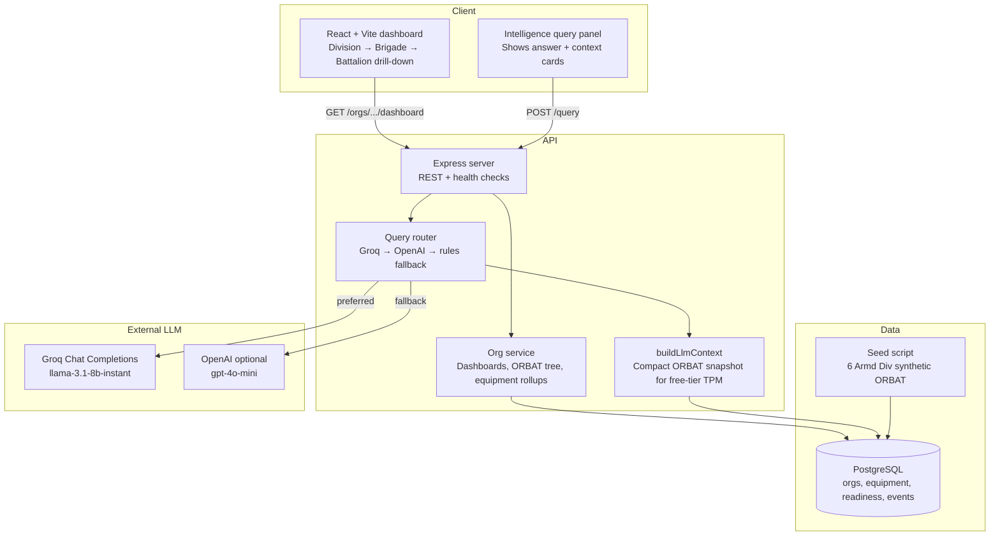

# FieldPulse

Division-level operational picture for **HQ 6 Armoured Division** (Gujranwala): ORBAT drill-down from Division → Brigade/Group → Battalion/Regiment, equipment holdings, readiness trends, and natural-language queries over the live dataset.

Battalion identities and numeric holdings are **synthetic** (generated for this application). Formation structure follows the publicly described 6 Armoured Division organisation.

---

## What you get

- **Division dashboard** — armoured brigades, 106 AD Bde, Div Artillery, Div Aviation (wartime), Div Troops, Div Logistics
- **Drill-down** — click any formation for its own KPIs, subordinate units, charts, and equipment table
- **Arm-specific holdings** — e.g. VT-4/Haider & Al-Khalid MBTs, M113/Talha APCs, Type 79A / AVLB bridging, signals C2/SATCOM nodes, M109A2 SPH, ASC/Ordnance/EME/Medical stocks
- **Charts** — equipment by category, 14-day readiness, subordinate readiness, serviceability
- **Division intelligence query** — Groq (free) when configured; OpenAI optional; rules fallback otherwise

---

## Architecture



| Piece | One-liner |
|-------|-----------|
| **React client** | Renders division picture, drill-down routes, charts, and the query panel |
| **Express API** | Serves org dashboards and runs the intelligence query pipeline |
| **PostgreSQL** | Stores hierarchical ORBAT, equipment holdings, readiness history, events |
| **Seed** | Loads synthetic 6 Armd Div structure and arm-specific equipment on startup |
| **buildLlmContext** | Builds a compact JSON snapshot so free-tier Groq stays under token limits |
| **Groq** | Primary NL answerer via OpenAI-compatible Chat Completions API |
| **OpenAI** | Optional second provider if configured |
| **Rules engine** | Deterministic keyword answers when no LLM key/call succeeds |
| **Docker Compose** | Runs `db` + `api` + `web`; API migrates and seeds on boot |

Deep dive on the LLM path: [LLM-INTEGRATION.md](LLM-INTEGRATION.md)

**Deploy:** see [DEPLOY.md](DEPLOY.md) — Netlify (frontend) + Render (API/DB).

---

## Quick start (Docker)

Start Docker Desktop, then:

```bash
docker compose up --build -d
```

- UI: http://localhost:8080  
- API: http://localhost:3001/health  

API container runs migrate + seed on startup.

### Enable Groq (free LLM) — recommended for local + live deploy

Groq gives a **free API tier** (rate-limited). FieldPulse prefers Groq → OpenAI → rules.

**1. Create a free Groq key**

1. Sign up at [console.groq.com](https://console.groq.com)
2. **API Keys** → [console.groq.com/keys](https://console.groq.com/keys)
3. **Create API Key** → copy `gsk_...`

**2. Local (Docker)**

```bash
cp .env.example .env
# edit .env:
# GROQ_API_KEY=gsk_your_key_here
# GROQ_MODEL=llama-3.1-8b-instant
docker compose up -d --build --force-recreate api
```

For `npm run dev:server`, use the same vars in `server/.env`.

**3. Live deploy (Railway / Render / Fly / etc.)**

On the **API** service only, set:

| Variable | Value |
|----------|--------|
| `GROQ_API_KEY` | your `gsk_...` key |
| `GROQ_MODEL` | `llama-3.1-8b-instant` |

Never put the key in GitHub, the React app, or `VITE_*` vars.

**4. Verify**

Ask on the division dashboard → `mode: groq`. No key → `mode: rules`. Optional `OPENAI_API_KEY` still works if Groq is unset.

**Safety:** commit `.env.example` only; revoke+rotate if a key ever leaks.
---

## Local development

```bash
docker compose up -d db
npm run install:all
npm run setup          # migrate + seed
npm run dev:server     # :3001
npm run dev:client     # :5173
```

---

## How the LLM is integrated (brief)

1. **Context build** (`buildLlmContext`) loads all orgs, equipment lines, and recent events from Postgres.  
2. **`POST /query`** tries **Groq** first (`GROQ_API_KEY`), then **OpenAI**, with a system prompt that restricts answers to the provided data.  
3. **Fallback** — if no key or the call fails, a keyword rules engine answers tanks/APCs, bridging, signals, readiness, and wartime attachments.  
4. **UI** — query panel sits under the division title; answers show provider/model pills plus readable **Context used** cards (not raw JSON).

### Ways to improve it later

- Retrieve only relevant slices (embeddings / SQL filters) instead of the full ORBAT every call  
- Tool-calling: let the model request `summarizeEquipment(orgCode)` etc.  
- Cite unit codes in a structured JSON schema for charts  
- Scope queries to the current drill-down org, not only division  
- Cache context; stream tokens to the UI  
- Add auth and audit logging before any real deployment  

---

## Disclaimer

Portfolio / training software. Not affiliated with the Pakistan Army or NestAI. Not for operational use.
